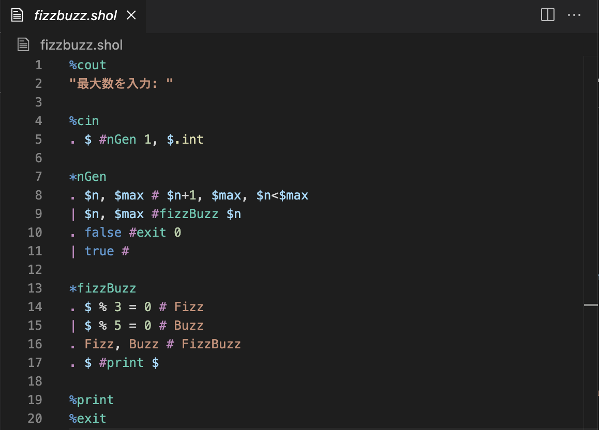

# Shol Syntax Highlight

[Shol 言語](https://se1getsu.github.io/shol/) 公式の VSCode 拡張機能です。

## 機能

Shol 言語のコードを色分けして表示し、可読性を向上させます。

対応している拡張子：

- `*.shol`：Shol ソースファイル

- `*.shi`：Shol 中間生成ファイル

## インストール方法

1. VSCode の拡張機能パネルを開きます (Ctrl+Shift+X)
2. 「Shol」を検索
3. 「Shol Syntax Highlight」をインストール

## 既知の問題

現在、既知の問題はありません。

不具合の報告やご質問がある場合は、[Issues](https://github.com/Se1getsu/shol-syntax-highlight/issues) または [Discord コミュニティ](https://discord.gg/CrsZKZQeWT) にお寄せください。
